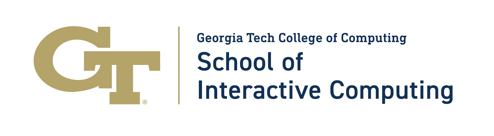

The Georgia Tech <a href="https://ic.gatech.edu/">School of Interactive Computing</a> is hosting the <strong>2025 Summit on Responsible Computing, AI, and Society</strong>, October 27-29, 2025.

<h1>Overview</h1>

The Summit on Responsible Computing, AI, and Society aims to explore the future of computing for health, sustainability, human-centered AI, and policy. The summit will bring together luminary researchers in computing for health, sustainability, human-centered AI, and tech policy to lay out the frontiers of these critical fields, and to plot out how they must evolve. 

Please see the <a href="/cfp">Call for Contributions</a>

<b>Update: The deadline for contributions has been extended to Sunday, August 31st.</b>

<h1>Keynote Speaker</h1>

<b><a href="https://www.rummanchowdhury.com/">Rumman Chowdhury, Ph.D.</a></b>

Title: TBA

Dr. Rumman Chowdhury is a data scientist and social scientist. She is the Co-founder of the tech nonprofit Humane Intelligence, which builds a community of practice around evaluations of AI models. She was appointed by the Biden Administration as the first United States Science Envoy for Artificial Intelligence. Dr. Chowdhury is also Responsible AI Fellow at Harvard University’s Berkman Klein Center for Internet and Society. Previously, Dr. Chowdhury was the Director of the ML Ethics, Transparency, and Accountability (META) team at Twitter, as well as the Global Lead for Responsible AI at Accenture Applied Intelligence. She was named one of Time's 100 most Influential People in AI, BBC’s 100 Women, Worthy Magazine's Top 100, recognized as one of the Bay Area’s top 40 under 40 and named by Forbes as one of Five Who are Shaping AI. Chowdhury holds two undergraduate degrees from MIT, a master's degree in Quantitative Methods of the Social Sciences from Columbia University, and a doctorate in political science from the University of California, San Diego.

<h1>Doctoral Consortium</h1>

The Summit will feature a Doctoral Consortium on October 27th, 2025, which will offer Ph.D. students opportunities to introduce their research to the broader research community, and receive mentorship, and constructive input.  We are looking for individuals just before, or just after, their PhD proposal defense who are working in the area of human-centered AI, responsible AI, responsible computing, sustainability (environmental or community), or health. 

Please see the <a href="/doctoral-consortium">Doctoral Consortium</a> page for information about how to apply.

<h1>Venue</h1>

The Summit will take place at the Georgia Tech Academy of Medicine historical building in Midtown Atlanta, Georgia. It is very near to the School of Interactive Computing and the GT Machine Learning Center.

<h1>Partner Event</h1>

 On Wednesday October 29th at 3:00pm the <a href="https://www.aiai.network/">Atlanta Interdisciplinary Artificial Intelligence (AIAI) Network</a> will hold their Fall 2025 Kickoff event. AIAI is an organization that aims to bring the city of Atlanta, with its historical place in the civil rights movement, to current conversations about the biases embedded in our AI systems. It is a humanities-forward organization that seeks an equitable, ethical, and justice-oriented approach to AI where humanistic ways of thinking come together with technical knowledge and community expertise.

<h1>Stay in Touch</h1>

If you would like to receive updates about the current or future Summits, you can <a href="https://forms.office.com/r/pD7sWN7Ff8">add yourself to our mailing list</a>. 

<h1>Sponsors</h1>

The Summit graciously thanks its sponsors for proving support for the Doctoral Consortium.

| Primary Sponsor                                      |   | 
|-----------------------------------------------|---|
| | <a href="https://ic.gatech.edu/">Georgia Tech School of Interactive Computing</a> |

| Gold Sponsors | |
|-----------------------------------------------|---|
| | <a href="https://responsible.computing.gatech.edu/">Georgia Tech Center for Advancing Responsible Computing</a> |
|  | <a href="https://ai.gatech.edu/">The AI Hub at Georgia Tech</a> |
| | <a href="https://www.nsf.gov/">National Science Foundation |
|  | <a href="https://www.google.com/">Google |

| Silver Sponsors | |
|-----------------------------------------------|---|
|  | <a href="https://www.microsoft.com/">Microsoft |

<h1>Previous Summits</h1>

<ul>
  <li><a href="https://rcais.github.io/rcais2024.github.io/">2024 Summit on Responsible Computing, AI, and Society</a></li>

</ul>

